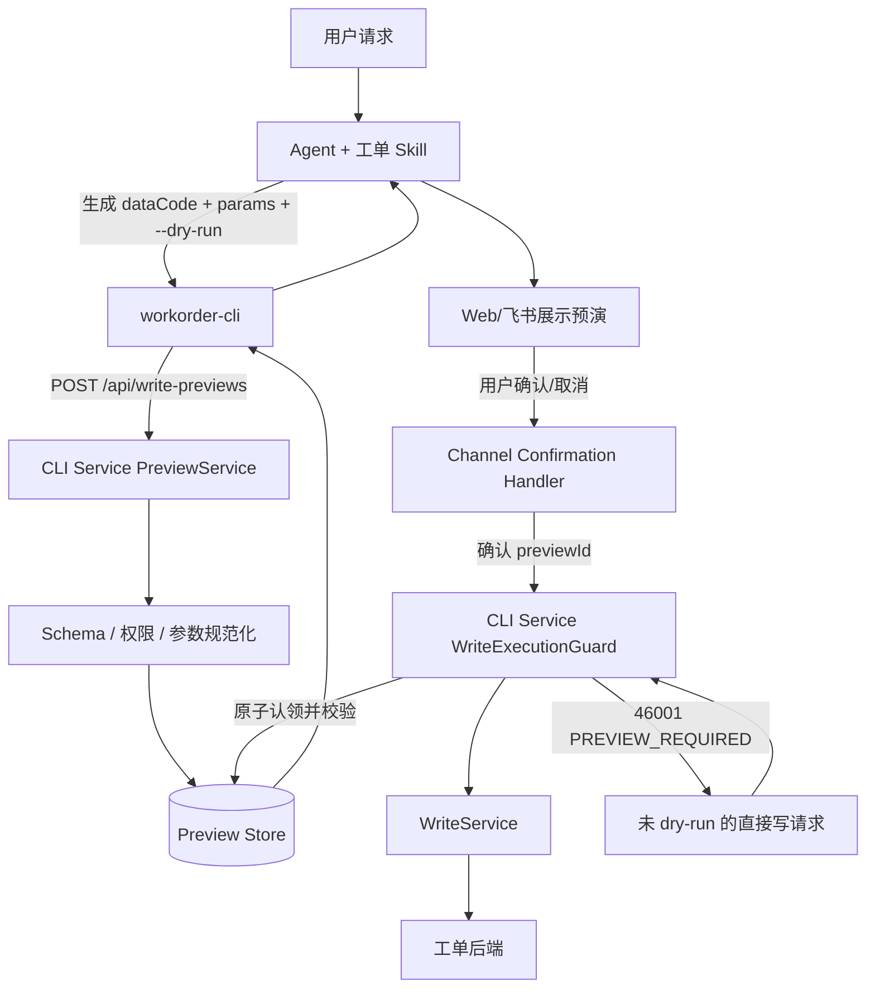
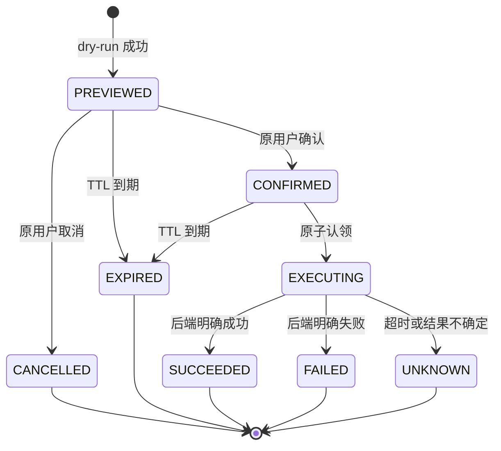

# dry-run 安全校验下沉 CLI Service 技术方案

## 1. 背景

当前工单写操作的 dry-run 协议同时存在于以下位置：

- 工单 Skill 通过提示词要求 Agent 执行 `PREVIEW → VERIFY → WAIT_CONFIRM → EXECUTE`；
- `AgentLoop` 硬编码识别 `executeCliCommand`、`--dry-run` 和确认 JSON；
- `WriteConfirmationService` 从 dry-run 命令字符串中删除 `--dry-run`，保存为待执行命令；
- CLI 将 `--dry-run` 请求转换为 CLI Service `/api/preview` 调用；
- CLI Service `/api/execute` 当前可直接执行写操作，不要求调用方提供有效预演凭证。

该实现把工单 Skill 的执行协议耦合进了通用 ReAct 主循环，同时把安全性建立在模型是否正确遵循提示词之上。模型可能漏掉 dry-run、修改正式执行参数，或者直接调用真实写命令，因此 Skill 文档和 Agent 判断不能作为最终安全边界。

本方案将 dry-run 的强制校验下沉到 CLI Service。CLI Service 成为所有工单写操作的唯一安全执行入口；Agent 只负责按照工单 Skill 生成预演请求，不再负责判断预演是否合法，也不能绕过服务端门禁。

## 2. 建设目标

1. 所有 `WriteDataCodeEnum` 写操作在真实执行前必须产生有效预演记录。
2. 未预演直接调用 `/api/execute` 时，由 CLI Service 拦截并返回明确错误码，提示调用方先执行 dry-run。
3. 正式执行必须与预演的用户、`dataCode` 和规范化参数完全一致。
4. 预演必须具有有效期，并且只能成功消费一次。
5. 用户确认必须绑定具体预演，不能确认一份预演后执行另一组参数。
6. `AgentLoop` 删除全部工单 dry-run 特有判断；工单 Skill 卸载后，Agent 中不残留 dry-run 机制。
7. 即使调用方绕过 Agent、未加载 Skill 或错误生成真实写命令，CLI Service 仍能阻止写入。
8. Web、飞书和后续 Channel 使用同一套预演与确认协议。

## 3. 非目标

- 本次不改变工单后端各业务接口的业务校验逻辑。
- 本次不要求 CLI Service理解用户自然语言。自然语言到 `dataCode + params` 的转换仍由 Agent 和 Skill 完成。
- 本次不把登录、Token 刷新等身份能力交给 Agent。
- 本次不依赖模型判断“预演是否安全”；模型输出只作为待校验输入。

## 4. 设计原则

### 4.1 Skill 声明协议，服务端执行协议

工单 Skill 继续声明：

- 哪些能力属于写操作；
- 写操作必须先调用 dry-run；
- 展示预演后必须等待用户确认；
- 收到服务端 `PREVIEW_REQUIRED` 等错误时应如何恢复。

Skill 不承担安全强制职责。是否允许真实写入只由 CLI Service 的确定性代码决定。

### 4.2 Agent 不作为安全边界

Agent 可以生成正确的 dry-run 命令，但系统不能假设它一定正确。以下情况均必须由 CLI Service 拦截：

- Agent 忘记添加 `--dry-run`；
- Agent 未加载或已卸载工单 Skill；
- Agent 在确认前尝试执行；
- Agent 在预演后修改参数；
- Agent 重放已经执行过的预演；
- 其他客户端直接调用 `/api/execute`。

### 4.3 预演与执行绑定结构化请求

不得再通过“从命令字符串中删除 `--dry-run`”构造正式命令。CLI Service 应保存经过规范化的结构化请求，并使用摘要绑定：

```text
requestDigest = SHA-256(
  userId + "\n" +
  dataCode + "\n" +
  schemaVersion + "\n" +
  canonicalJson(params)
)
```

其中 `canonicalJson` 必须保证对象字段按名称稳定排序、数值类型规范化、数组顺序保留、空值策略固定。不得直接对原始 JSON 字符串计算摘要。

## 5. 总体架构



职责划分：

| 组件 | 职责 |
| --- | --- |
| 工单 Skill | 指导 Agent 发现 Schema、构建参数、调用 dry-run、展示结果并等待确认 |
| Agent/ReAct | 理解用户意图、选择 Skill、生成工具调用；不判断 dry-run 是否有效 |
| workorder-cli | 将命令行参数转换为结构化请求；透传 `previewId` 和错误码 |
| CLI Service `PreviewService` | 识别写操作、校验 Schema/权限、规范化参数、生成预演和 `previewId` |
| CLI Service `WriteExecutionGuard` | 强制先预演、校验身份和摘要、校验确认状态、原子消费、防重放 |
| Channel Confirmation Handler | 校验真实确认人和会话，将确认/取消决定提交给 CLI Service |
| `WriteService` | 只接收 Guard 已授权的内部执行请求，不再被 Controller 直接调用 |

## 6. 预演状态机



约束：

- 只有 `PREVIEWED` 可以确认或取消；
- 只有 `CONFIRMED` 可以原子迁移到 `EXECUTING`；
- `SUCCEEDED`、`FAILED`、`UNKNOWN`、`CANCELLED`、`EXPIRED` 都是终态；
- 同一个 `previewId` 最多进入一次 `EXECUTING`；
- 业务失败也不能使用同一 `previewId` 自动重试。需要用户重新 dry-run，避免业务状态变化后重放旧计划；
- 执行超时且结果不确定时进入 `UNKNOWN`，禁止自动重试，由审计或幂等查询确认实际结果。

## 7. 数据模型

新增 `WritePreview`：

```java
class WritePreview {
    String previewId;
    String userId;
    String tenantId;
    String dataCode;
    Map<String, Object> canonicalParams;
    String requestDigest;
    String schemaVersion;
    String operationName;
    String endpoint;
    String httpMethod;
    String riskLevel;
    String impact;
    PreviewStatus status;
    Instant createdAt;
    Instant expiresAt;
    Instant confirmedAt;
    Instant executionStartedAt;
    Instant completedAt;
    String traceId;
    String resultSummary;
}
```

推荐将其保存在 Redis：

- Key：`workorder:write-preview:{previewId}`；
- TTL：默认 10 分钟，可配置；
- 状态迁移使用 Lua 或等价 CAS 保证原子性；
- 审计事件异步写入持久化日志或数据库，不能只依赖 Redis；
- `canonicalParams` 中的敏感字段按现有日志脱敏策略处理，日志不得记录 Token。

如果首期暂不引入 Redis，可提供单实例内存实现用于开发，但生产环境不得使用内存实现，否则多实例和重启会破坏确认状态。

## 8. API 契约

### 8.1 创建预演

建议将现有 `POST /api/preview` 演进为：

```http
POST /api/write-previews
Authorization: Bearer <access-token>
Content-Type: application/json
```

请求：

```json
{
  "dataCode": "work_order_create",
  "params": {
    "type": 0,
    "title": "服务器故障",
    "content": "无法访问服务",
    "priorityLevel": 1,
    "flowId": 3
  }
}
```

响应：

```json
{
  "code": 0,
  "message": "success",
  "data": {
    "previewId": "wp_01J...",
    "dataCode": "work_order_create",
    "operation": "创建工单",
    "httpMethod": "POST",
    "endpoint": "/workOrder/create",
    "canonicalParams": {
      "content": "无法访问服务",
      "flowId": 3,
      "priorityLevel": 1,
      "title": "服务器故障",
      "type": 0
    },
    "readableParams": [],
    "riskLevel": "medium",
    "impact": "创建一张新工单",
    "schemaVersion": "1",
    "requestDigest": "sha256:...",
    "requiresConfirmation": true,
    "expiresAt": "2026-08-31T12:10:00Z"
  },
  "traceId": "..."
}
```

创建预演时必须完成：

1. 解析并校验 Access Token，得到可信 `userId`；
2. 校验 `dataCode` 属于 `WriteDataCodeEnum`；
3. 根据实时 Schema 校验必填项、类型、枚举和未知字段；
4. 校验当前用户是否有资格预演该操作；
5. 规范化参数并生成摘要；
6. 保存 `PREVIEWED` 记录；
7. 返回结构化计划和 `previewId`。

预演只表示“该请求具备进入确认阶段的条件”，不表示已经授权执行。

### 8.2 确认或取消预演

```http
POST /api/write-previews/{previewId}/decision
Authorization: Bearer <same-user-access-token>
X-Channel-Service-Key: <trusted-channel-key>
```

请求：

```json
{
  "decision": "CONFIRM",
  "channel": "FEISHU",
  "conversationId": "oc_xxx",
  "requesterId": "ou_xxx"
}
```

CLI Service 必须使用 Access Token 重新解析用户身份，并要求与预演记录的 `userId` 一致。`requesterId`、`conversationId` 仅用于审计，不能替代服务端解析出的工单用户身份。

Channel 层仍需验证“原请求人在原会话确认”。该逻辑属于确认交互，不属于 ReAct Agent，可由现有 `WriteConfirmationService` 过渡承担，最终可以简化为 `previewId ↔ channel context` 映射。

### 8.3 正式执行

```http
POST /api/execute
Authorization: Bearer <same-user-access-token>
Content-Type: application/json
```

请求 DTO 扩展：

```json
{
  "previewId": "wp_01J...",
  "dataCode": "work_order_create",
  "params": {
    "type": 0,
    "title": "服务器故障",
    "content": "无法访问服务",
    "priorityLevel": 1,
    "flowId": 3
  }
}
```

`WriteExecutionGuard` 的校验顺序：

1. 根据 Token 解析 `userId`；
2. `previewId` 是否存在；
3. 是否过期；
4. 状态是否为 `CONFIRMED`；
5. `userId` 是否与预演一致；
6. `dataCode` 是否一致；
7. 对提交参数重新规范化并计算摘要，是否与预演一致；
8. 当前 Schema 版本是否仍可执行；
9. 原子执行 `CONFIRMED → EXECUTING`；
10. 将预演中保存的 `canonicalParams` 传给 `WriteService`，不使用调用方未经信任的原始参数。

为减少确认和执行之间的竞态，后续可以增加内部接口 `confirmAndExecute(previewId)`，由 Channel Confirmation Handler 在一次服务调用中完成原子确认和执行。首期保留分离接口，便于兼容现有调用链。

## 9. 错误码

统一使用 `ApiResponse.code` 作为稳定业务错误码，HTTP 状态用于网关、监控和非 Agent 客户端。Agent 和 CLI 必须根据业务错误码处理，不得解析中文文本作流程判断。

| 业务码 | 标识 | HTTP | 触发条件 | 建议消息 |
| --- | --- | --- | --- | --- |
| `46001` | `WRITE_PREVIEW_REQUIRED` | 428 | 写请求没有 `previewId` | 该操作是写操作，必须先使用 `--dry-run` 完成预演，再由用户确认后执行。 |
| `46002` | `WRITE_PREVIEW_NOT_FOUND` | 404 | `previewId` 不存在 | 未找到对应预演，请重新执行 `--dry-run`。 |
| `46003` | `WRITE_PREVIEW_EXPIRED` | 410 | 预演过期 | 预演已过期，请重新执行 `--dry-run`。 |
| `46004` | `WRITE_PREVIEW_NOT_CONFIRMED` | 428 | 尚未确认 | 预演尚未获得用户确认，禁止执行真实写操作。 |
| `46005` | `WRITE_PREVIEW_MISMATCH` | 409 | 用户、dataCode 或参数摘要不一致 | 正式执行参数与预演不一致，请使用当前参数重新预演。 |
| `46006` | `WRITE_PREVIEW_ALREADY_CONSUMED` | 409 | 重复执行 | 该预演已经处理，不能重复执行。 |
| `46007` | `WRITE_PREVIEW_CANCELLED` | 409 | 已取消 | 该预演已取消，请重新发起操作。 |
| `46008` | `WRITE_SCHEMA_CHANGED` | 409 | Schema 不兼容变化 | 操作契约已更新，请重新查询 Schema 并执行 dry-run。 |
| `46009` | `WRITE_PREVIEW_FORBIDDEN` | 403 | 非原用户操作 | 只能由创建该预演的用户确认和执行。 |
| `46010` | `WRITE_PREVIEW_INVALID` | 400 | 预演参数未通过 Schema 校验 | 预演参数不合法，请根据最新 Schema 修正后重试。 |

Agent 跳过 dry-run 的标准响应示例：

```json
{
  "code": 46001,
  "message": "该操作是写操作，必须先使用 --dry-run 完成预演，再由用户确认后执行。",
  "data": {
    "requiredAction": "DRY_RUN",
    "recoverable": true,
    "dataCode": "work_order_create"
  },
  "traceId": "..."
}
```

结构化的 `requiredAction` 用于提示 Agent 恢复流程。工单 Skill 应规定：收到 `requiredAction=DRY_RUN` 后重新查询必要 Schema、生成 dry-run，不得原样重试真实写命令。

## 10. CLI 改造

### 10.1 dry-run

现有：

```text
workorder-cli --dry-run work_order_create ...
```

CLI 调用 `/api/write-previews`，输出保留人类可读内容，同时必须附带机器可读字段：

```json
{
  "previewId": "wp_01J...",
  "requestDigest": "sha256:...",
  "requiresConfirmation": true,
  "expiresAt": "..."
}
```

供 Agent 使用的执行器应优先返回完整 JSON，不应要求 Agent 从终端排版文本中提取 `previewId`。

### 10.2 正式执行

正式执行增加预演凭证：

```text
workorder-cli --preview-id wp_01J... work_order_create ...
```

CLI 将 `previewId`、`dataCode` 和解析后的参数一并发送到 `/api/execute`。即使调用方修改命令，CLI Service 也会因摘要不一致返回 `46005`。

不得使用本地文件隐式缓存“最近一次 previewId”。本地缓存无法安全区分用户、会话、并发操作和多实例 Agent，容易把一份预演错误绑定到另一份写请求。

## 11. AiAssistant 改造

### 11.1 从 `AgentLoop` 删除

删除以下工单专有逻辑：

- `isConfirmationMessage`；
- `isValidConfirmation`；
- `findLatestDryRunCommand`；
- `isUnconfirmedDryRunExecution`；
- `removeDryRun`；
- 对工具名 `executeCliCommand` 的 dry-run 特判；
- 对命令字符串是否包含 `--dry-run` 的判断；
- 从会话历史寻找最近一条 dry-run 命令的逻辑；
- 在 ReAct 循环中创建飞书确认记录和中止循环的硬编码。

删除后，`AgentLoop` 只负责通用的 LLM 与工具调用循环。无论工单 Skill 是否加载、卸载或替换，都不包含 dry-run 规则。

### 11.2 增加通用预演事件处理

为了保留飞书卡片等体验，在工具执行边界增加通用 `PreviewCreatedEvent`，而不是在 ReAct 主循环中识别命令字符串：

```java
record PreviewCreatedEvent(
    String skillKey,
    String previewId,
    String requestDigest,
    String summary,
    Instant expiresAt,
    boolean requiresConfirmation
) {}
```

当 CLI 返回结构化 `requiresConfirmation=true` 时，工具适配器发布事件。Channel 层监听事件并展示确认 UI。该事件机制不判断预演是否安全；安全性已经由 CLI Service 保证。

### 11.3 确认消息不再进入 ReAct

Web 确认 JSON、飞书按钮回调应在 Channel Router 层被识别并直接提交 `previewId` 决策，不再把确认消息发送给 LLM。这样可以避免模型重新构造命令或改变参数。

过渡期可以保留 `WriteConfirmationService`，但记录内容应从“去掉 `--dry-run` 后的命令字符串”改为：

- `previewId`；
- `requestDigest`；
- 用户与 Channel 上下文；
- 展示摘要；
- TTL 和状态。

CLI Service 上线稳定后，预演和执行状态以 CLI Service 为准；AiAssistant 只保存 Channel 展示映射，或者完全通过 CLI Service 查询。

## 12. 工单 Skill 改造

Skill 继续指导 Agent：

1. `DISCOVER`；
2. `SCHEMA`；
3. 构建期望参数；
4. 调用 `--dry-run`；
5. 展示 CLI Service 返回的结构化预演；
6. 等待 Channel 层完成确认；
7. 根据最终执行结果回复用户。

Skill 中应删除以下安全责任表述：

- 要求 Agent 自己证明 dry-run 已完整验证后才能放行；
- 要求 Agent 从历史消息中寻找完整命令；
- 要求 Agent 通过字符串删除 `--dry-run` 构造正式命令；
- 把确认 JSON 解析职责交给模型。

改为明确说明：

- CLI Service 是 dry-run 和正式执行的权威校验方；
- 收到 `46001` 时必须执行 dry-run；
- 收到 `46005`、`46008` 时必须重新读取 Schema 并重新预演；
- `previewId` 只能与原预演参数配套使用；
- 用户确认由系统 Channel 层处理，Agent 不得模拟确认。

Skill 卸载后，Agent 不再具有工单调用协议；即使工具仍被错误暴露，CLI Service 门禁仍会阻止未经预演和确认的写请求。

## 13. CLI Service 代码结构建议

```text
cli-service/src/main/java/com/example/workorder/cli/
├── controller/
│   ├── WritePreviewController.java
│   └── ApiController.java
├── dto/
│   ├── request/
│   │   ├── CreateWritePreviewRequest.java
│   │   ├── WritePreviewDecisionRequest.java
│   │   └── GuardedExecuteRequest.java
│   └── response/
│       └── WritePreviewResponse.java
├── guard/
│   ├── WriteExecutionGuard.java
│   ├── WriteGuardDecision.java
│   ├── WriteGuardErrorCode.java
│   └── CanonicalRequestDigester.java
├── preview/
│   ├── WritePreview.java
│   ├── WritePreviewStatus.java
│   ├── WritePreviewStore.java
│   └── RedisWritePreviewStore.java
└── service/
    ├── PreviewService.java
    └── WriteService.java
```

调用约束：

```text
Controller
  └── WriteExecutionGuard.authorizeAndClaim(...)
        └── WriteService.executeAuthorized(...)
```

`WriteService.executeAuthorized` 应限制为包可见或接收不可由 Controller 自行构造的 `AuthorizedWriteRequest`，防止后续开发再次绕过 Guard。

## 14. 安全与一致性

### 14.1 身份绑定

- `userId` 必须由 CLI Service 调用 `AuthService.validateToken` 得到；
- 禁止相信请求体传入的 `userId`；
- 预演、确认、执行三阶段都重新校验 Token；
- 管理员权限也不能绕过预演，仅可按业务权限执行对应 dataCode。

### 14.2 参数一致性

- 预演和执行使用同一个规范化器；
- 未知字段默认拒绝，防止字段未展示却在后端生效；
- Schema 默认值必须在预演时展开并进入摘要；
- CLI Service 最终执行预演中保存的参数，而不是请求体原始参数；
- Schema 发生不兼容变化时要求重新预演。

### 14.3 防重放与并发

- `CONFIRMED → EXECUTING` 必须原子执行；
- 多个确认或执行请求只有一个可以成功认领；
- 终态请求返回稳定错误码，不再次触发后端；
- 审计记录包含 `previewId`、`requestDigest`、`userId`、`dataCode`、状态、traceId，不记录明文 Token。

### 14.4 服务间确认

- Channel 决策接口必须使用独立的服务身份认证，不能只依靠可伪造 Header；
- 同时携带终端用户 Access Token，CLI Service 校验其与预演用户一致；
- Web/飞书的原会话、原操作者校验仍由 Channel 层完成；
- Agent 工具不能直接获得用于伪造 Channel 确认的服务凭证。

## 15. 兼容与迁移

### 阶段一：CLI Service 建立影子校验

- 新增 Preview Store、摘要计算和错误码；
- `/api/preview` 返回 `previewId`，保留旧字段；
- `/api/execute` 记录缺少 previewId 的请求，但暂不阻断；
- 观察现有客户端是否存在直接写调用。

### 阶段二：Agent 和 CLI 接入新协议

- CLI 支持 `--preview-id`；
- AiAssistant 改为保存 `previewId`，确认消息从 ReAct 分流；
- 工单 Skill 更新为新协议；
- Web、飞书完成联调。

### 阶段三：开启强制门禁

- 配置 `workorder.write-preview.enforcement=required`；
- 所有缺少有效 previewId 的写请求返回 `46001`；
- `/api/execute` 必须经过 `WriteExecutionGuard`；
- 监控 46001、46005、46006 的数量和来源。

### 阶段四：删除 AgentLoop 旧逻辑

- 删除 dry-run 和确认 JSON 的硬编码；
- 删除命令字符串回溯与 `removeDryRun`；
- 简化 AiAssistant 的确认存储；
- 清理旧配置和兼容分支。

禁止先删除 AgentLoop 门禁、后上线 CLI Service 门禁。正确顺序必须是：CLI Service 支持并验证新协议 → 所有客户端迁移 → 开启服务端强制拦截 → 删除 AgentLoop 旧逻辑。

## 16. 测试方案

### 16.1 CLI Service 单元测试

- 写 dataCode 缺少 previewId 返回 `46001`；
- 不存在、过期、取消、未确认、已消费分别返回对应错误码；
- 不同用户使用同一 previewId 返回 `46009`；
- 修改 dataCode 或任一参数返回 `46005`；
- JSON 字段顺序不同但语义一致时摘要一致；
- 数值、布尔、null、嵌套对象和数组的规范化稳定；
- 同一 previewId 并发执行时只有一次进入 `WriteService`；
- Schema 版本变化返回 `46008`；
- 读操作不经过 WriteExecutionGuard。

### 16.2 CLI 集成测试

- `--dry-run` 返回 previewId 且不会调用工单后端写接口；
- 不带 `--dry-run` 和 `--preview-id` 的写命令稳定返回 `46001`；
- 带有效 previewId 且参数一致时可以执行；
- 修改一个 CLI flag 后返回 `46005`；
- 重复执行返回 `46006`；
- CLI 对错误码原样输出，不改写成模糊的通用错误。

### 16.3 AiAssistant 测试

- Agent 直接生成真实写命令时，工具结果为 `46001`，后端无写调用；
- Agent 正常 dry-run 后能够展示确认卡片；
- 用户确认消息不调用 LLM；
- 飞书非原请求人确认被拒绝；
- 用户修改参数后旧 previewId 失效，必须重新 dry-run；
- 工单 Skill 未加载或卸载后，AgentLoop 中不存在 dry-run 判断；
- 即使通过测试工具直接调用 `/api/execute`，CLI Service 仍能拦截。

### 16.4 故障测试

- Redis 不可用时采用 fail-closed：拒绝正式写入，不允许绕过预演；
- CLI Service 重启后预演状态仍可用；
- 后端写调用超时进入 `UNKNOWN`，不自动重试；
- 确认和过期同时发生时只有一个状态迁移成功；
- 多实例 CLI Service 下仍只能执行一次。

## 17. 监控与审计

新增指标：

- `write_preview_created_total{dataCode}`；
- `write_preview_confirmed_total{dataCode}`；
- `write_preview_cancelled_total{dataCode}`；
- `write_guard_rejected_total{reason,dataCode}`；
- `write_preview_execution_total{status,dataCode}`；
- `write_preview_duration_seconds`；
- `write_preview_expired_total`。

审计日志至少包含：

```text
previewId, requestDigest, userId, dataCode, schemaVersion,
previousStatus, newStatus, channel, traceId, timestamp
```

当 `46001` 突然增加时，通常说明某个 Agent、旧 CLI 或外部客户端未遵循新协议；当 `46005` 增加时，通常说明预演后参数被修改或规范化规则不一致。

## 18. 验收标准

满足以下条件后视为改造完成：

1. 任意写 dataCode 未携带有效 previewId 时均返回 `46001`，工单后端零写调用。
2. AgentLoop 不包含 `--dry-run`、`last_dry_run`、`confirm_execute` 或具体 CLI 工具名判断。
3. 预演、确认和执行绑定同一用户、dataCode、参数摘要和 Schema 版本。
4. 同一 previewId 在并发条件下最多产生一次真实后端调用。
5. Web 与飞书确认均不经过 LLM。
6. 工单 Skill 卸载后不影响 Agent 核心循环；CLI Service 仍能独立阻止未预演写请求。
7. 错误响应包含稳定业务码和 `requiredAction`，Agent 无需解析自然语言错误。
8. 全链路可以通过 `previewId + traceId` 还原预演、确认和执行过程。

## 19. 最终结论

改造后，Agent 的职责是“按 Skill 生成 dry-run 请求并向用户解释结果”，而不是“保证写操作一定安全”。CLI Service 通过 `WriteExecutionGuard` 强制执行先预演、再确认、参数一致、一次性消费等规则。

如果 Agent 未调用 dry-run 而直接执行写操作，CLI Service 必须返回 `46001 WRITE_PREVIEW_REQUIRED`，提示 Agent 先预演，并确保请求不会到达 `WriteService` 和工单后端。这样 dry-run 机制随工单业务留在 CLI Service 和工单 Skill 中，不再污染或依赖通用 ReAct Agent。
