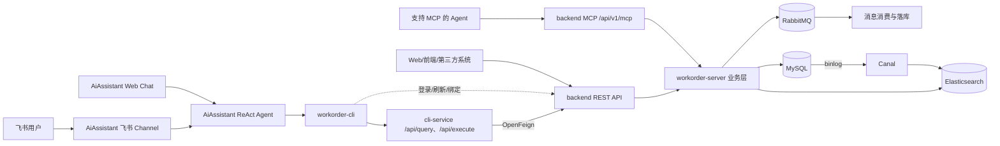

# 工单项目架构与面试讲解

> 本文按当前仓库代码整理，目标是能用“入口—编排—协议适配—业务执行—数据基础设施”这一条主线讲清项目。文中“当前实现”与“可演进方案”会明确区分，避免把规划说成已经落地。

## 1. 总体链路

### 1.1 一句话介绍

这是一个支持 Web/HTTP、飞书自然语言和标准 Agent 协议三种入口的智能工单系统。核心业务由 `backend` 承担；`AiAssistant` 把自然语言转换为可验证的工具调用；`workorder-cli` 把工具意图转换为结构化命令；`cli-service` 用稳定的 `dataCode + params` 协议屏蔽后端接口变化。

### 1.2 模块职责

| 模块 | 技术栈 | 核心作用 | 边界 |
|---|---|---|---|
| AiAssistant | Java 17、Spring Boot、LLM Function Calling、MongoDB、Redis、Elasticsearch、ONNX、飞书 SDK | 理解用户意图，以 ReAct 循环检索知识、规划任务并调用工具；管理会话记忆和飞书渠道 | 不实现工单业务规则，业务事实以 backend 为准 |
| workorder-cli | Go、Cobra、Viper | 将 Agent 生成的命令解析为 `dataCode + params`，调用统一接口，并把结果格式化为稳定 JSON | 不直接编排业务流程；登录和渠道绑定等少量身份接口直连 backend |
| cli-service | Java 17、Spring Boot、OpenFeign | 对 CLI 暴露统一读接口 `/api/query` 和写接口 `/api/execute`，完成鉴权、参数转换、路由、响应归一化与写审计 | 是协议适配层，不保存业务数据，不应复制业务规则 |
| backend/workorder-api | 纯 Java Jar、DTO/Param/VO/Service 接口 | 提供 server 与调用方共享的编译期契约，降低重复 DTO 和字段漂移 | 它不是独立进程，也不是网关 |
| backend/workorder-server | Spring Boot、MyBatis-Plus、MySQL、RabbitMQ、Elasticsearch、Canal、Spring AI MCP | 承载工单、流程、组织、认证、消息、统计、搜索等核心业务，并暴露 REST 与 MCP 能力 | 是业务事实源；MySQL 是核心事务数据源 |

这里常说的“后端两个模块”是 `workorder-api` 与 `workorder-server`：前者是契约，后者是实现和运行时服务。

### 1.3 总体架构图



### 1.4 三条用户使用链路

#### 链路一：飞书自然语言链路

1. 飞书长连接接收事件，解析文本、发送人和会话标识。
2. 渠道层做消息去重、限流、身份映射，并将飞书用户映射为工单系统用户。
3. 同一会话通过会话锁串行执行，避免两条消息同时修改一份记忆或重复执行写操作。
4. AiAssistant 进入 ReAct 循环：补充知识库上下文和短期记忆，调用 LLM；若模型请求工具，则执行 `workorder-cli`。
5. CLI 调用 cli-service，cli-service 再通过 OpenFeign 调用 backend。
6. 查询结果回到模型，由模型组织自然语言答案并经飞书回复。
7. 写操作先执行 `--dry-run`。飞书发送确认卡片，用户点击确认后才执行真实写入，降低自然语言误操作风险。

#### 链路二：后端 REST 接口链路

Web 前端或第三方系统直接调用 `workorder-server` 的 Controller，例如工单、流程、工作台、登录和组织管理接口。JWT 过滤器负责认证，Controller 做协议接入，Service 执行业务规则，MyBatis-Plus 操作 MySQL。这条链路最短，适合确定性 UI 操作和系统集成。

#### 链路三：Agent 接口链路

`workorder-server` 集成 Spring AI MCP Server，通过 Streamable HTTP 在 `/api/v1/mcp` 暴露工具。当前 `AssistantTools` 将工单关键词搜索注册为 `@Tool`，支持 MCP Agent 发现并调用。这条链路绕过 AiAssistant/CLI，适合外部标准 Agent 直接集成。

需要准确表达的是：`workorder-api` 为 Java 调用方共享接口与 DTO；MCP 才是当前代码中的 Agent 协议入口。二者都解决“能力对外开放”，但一个是编译期契约，一个是运行时协议。

### 1.5 是否有网关

当前仓库没有独立 API Gateway。没有发现 Spring Cloud Gateway、统一反向代理或服务注册发现模块。现在的“入口治理”分散在各服务：

- backend 用 Spring Security/JWT 保护 REST 接口；
- cli-service 负责 CLI 协议的统一入口、鉴权透传、TraceId 与响应归一化；
- AiAssistant 的 Channel 层负责飞书入口的去重、限流、身份解析和会话串行化；
- MCP Server 自身提供 Agent 协议入口。

面试时可补充：当前体量下不引入独立网关可以降低部署复杂度；当服务数量、外部调用方或流量增长后，可增加 Gateway 统一做路由、鉴权、限流、灰度、审计和协议隔离。但不要把 cli-service 直接称为“全系统网关”，它只代理 CLI/Agent 所需的一组业务能力。

## 2. 各部分详细设计

## 2.1 AiAssistant

### 2.1.1 知识库与 RAG

知识库以 Markdown 文件维护，启动时由 `KnowledgeBaseIngestor` 读取清单、切分文档，使用本地 `bge-small-zh-v1.5` ONNX 模型生成向量，并写入 Elasticsearch 向量索引。用户提问时，`QueryContextualizer` 结合最近用户消息补全检索语义，`ContentRetriever` 召回片段，片段作为 RAG 上下文进入 Prompt；最终答案再由 `CitationService` 校验和渲染引用。

设计上的关键点：

- Markdown 便于业务人员维护、Git 审核和版本追踪；相比把规则硬编码进 Prompt，更新成本更低。
- 本地 ONNX 向量化减少外部 Embedding API 的成本、时延和数据泄露面。
- Elasticsearch 同时支持向量检索、索引版本和别名切换，适合做可检索知识库。
- 构建由独立任务线程异步执行，状态有 `INITIALIZING/BUILDING/READY/DEGRADED/FAILED` 等；旧索引可继续服务，支持重建、健康检查和回滚，避免一次构建失败让问答整体不可用。
- 检索不是最终事实源：实时工单状态必须调用 CLI/backend；知识库适合流程说明、枚举解释和操作规范。

### 2.1.2 ReAct 主循环

AgentLoop 使用显式 `for` 循环，最大轮数由 `workorder.agent.max-rounds` 控制。每轮把消息和工具定义发给模型：

1. 模型无工具调用时，解析最终答案、校验知识引用并持久化记忆。
2. 模型返回结构化 `tool_calls` 时，先记录 assistant 工具请求，再由 `ToolDispatcher` 执行。
3. 工具结果以标准 `role=tool` 消息回填，模型进入下一轮观察结果并继续推理。
4. 达到最大轮数就中止，防止无限循环和成本失控。

循环内还实现了重复工具调用指纹去重、凭证类调用拦截、长任务 Todo 门禁、Hook 日志/Token 统计、错误分类与重试/降级。它采用原生 Function Calling，而不是从文本中用正则提取动作，因此参数边界更明确、调用链更可审计。

写操作使用“双重防线”：CLI 的 `--dry-run` 给出操作、端点、风险和参数预览；AgentLoop 比较预演命令与真实命令，只有收到有效确认消息才允许继续。飞书场景还会生成一次性确认记录和交互卡片。

### 2.1.3 会话记忆系统

当前是“会话级短期记忆”，不建设跨会话用户画像式长期记忆。MongoDB 保存会话文档，包含滚动摘要、最近消息、序列号、版本、状态和过期时间。

- 组装上下文时按 Token 预算计算系统 Prompt、RAG、摘要、最近消息、工具定义、输出预留和安全余量。
- 超过压缩阈值后，只把完整的 user/assistant/tool 消息单元滚入摘要，避免截断 Function Calling 链。
- `RollingSummaryCompressor` 生成固定章节摘要，并校验工单编号不能被模型改写或虚构。
- 工具结果经过保护/裁剪，凭证、密码和历史写授权不进入长期上下文。
- MongoDB 使用版本字段做乐观锁，TTL 控制会话过期；同一运行实例内再用 session lock 串行执行。

为什么用 MongoDB：消息结构和工具调用字段存在一定变化，文档模型比关系表更自然；按 sessionId 整体读取也符合上下文组装方式。为什么需要摘要：直接无限追加历史会超过模型上下文窗口，同时增加延迟和费用。

### 2.1.4 工具系统

工具方法通过 `@Tool`/参数注解注册，`ToolDispatcher` 将 Java 方法反射为 LLM 可见的 JSON Schema，并按工具名分发调用。这样 AgentLoop 不依赖具体工具，新增工具主要是新增 Bean 和注解。

#### Todo 工具

`todoWrite/todoList/todoUpdate/todoClear` 维护待办状态机（pending、in_progress、completed）。长任务必须先建立至少两个可验证阶段，连续多轮不更新会被提醒。它的价值不是替代业务工单，而是让 Agent 的多步推理显式化、可恢复、可观察。

#### 命令行工具

核心工具是 `executeCliCommand`，通过 `ProcessBuilder` 调用 `workorder-cli` 二进制；同时提供命令列表、Schema 发现和 Skill 加载能力。CLI 是受控能力边界：模型不能任意拼 HTTP URL，而是先发现 dataCode/Schema，再生成受约束命令。

本文按要求不介绍文件读写工具。当前代码中仍存在 `FileTools`，但属于计划删除的历史能力，面试时不把它作为架构亮点。

### 2.1.5 Skill

`SkillLoader` 扫描 Skill 文档，解析 frontmatter 元数据。系统 Prompt 先注入技能名称、描述等索引，模型需要时再加载完整内容；当前动态 Prompt 也可按配置预载指定技能全文。

Skill 把“怎样组合 CLI 完成一个业务任务”从 Java 代码中抽离，适合存放工作流知识、命令选择规则和输出规范。采用分层加载是为了减少 Prompt Token，同时让技能可以独立版本化和迭代。Skill 不是执行器，最终操作仍要经过工具、鉴权和 backend 业务校验。

### 2.1.6 飞书 Channel

飞书渠道采用官方 SDK 长连接接收事件，避免要求本地服务暴露公网回调地址。处理链包括：

- 事件解析：把飞书事件统一为 `InboundMessage/AgentRequest`；
- Redis 去重：按 messageId 防止飞书重投造成重复回复或重复写入；
- Redis 会话映射：将飞书会话映射为 Agent session；
- 身份绑定：通过 backend 的 channel identity 接口把飞书 openId/tenant 映射到工单用户并换取短期渠道 Token；
- 限流和同会话串行：保护模型与后端，避免记忆写冲突；
- 回复适配：长文本分片、失败重试、敏感 Token 脱敏；
- 写确认卡片：预演后发送确认/取消按钮，回调校验 operationId、用户、会话和有效期，保证确认不能跨人、跨会话复用。

ChannelAdapter 抽象将“消息平台协议”与 Agent 解耦，未来接入企业微信或钉钉时可以复用 AgentGateway、记忆和工具层。

## 2.2 workorder-cli

### 2.2.1 如何把指令转换为接口调用

CLI 使用 Cobra 组织命令、Viper 管理 URL/Token 配置。转换过程可以概括为：

```text
Agent 命令字符串
  → root 命令识别 command/dataCode
  → 子命令解析 flag 与 JSON body
  → 基础类型转换（bool/int/float/string）
  → 组装 { dataCode, params }
  → 读操作 POST /api/query，写操作 POST /api/execute
  → 统一解析 { code, message, data, traceId }
  → 输出稳定 JSON 给 Agent
```

例如 `work_order_page --page-num 1 --page-size 10` 最终转换为：

```json
{
  "dataCode": "work_order_page",
  "params": { "pageNum": 1, "pageSize": 10 }
}
```

CLI 支持 `list` 和 `schema` 自省。调用者可先发现可用 dataCode，再查询输入/输出 Schema；标量字段走 kebab-case flag，集合、对象、嵌套字段走 `--body`。这比让模型记忆所有 REST 路径和 DTO 更稳定。

认证、刷新、登出和飞书绑定挑战等身份生命周期接口由 CLI 直接调用 backend；业务读写统一走 cli-service。Token 由本地 TokenManager 管理，请求时转换为 `Authorization: Bearer ...`。

### 2.2.2 dry-run 为什么放在 CLI

CLI 最接近“模型意图变成真实请求”的边界，因此适合在这里将写命令翻译为可读执行计划。`--dry-run` 不发真实写请求，只输出目标 dataCode/端点、风险、影响和参数。它既可供人在终端检查，也可被飞书确认卡片复用。真正的权限和状态校验仍由 backend 执行，dry-run 不能替代服务端安全校验。

## 2.3 cli-service

### 2.3.1 统一读写接口的作用

cli-service 将很多业务接口收敛为两个稳定入口：

- `POST /api/query`：只读查询；
- `POST /api/execute`：有副作用的写操作。

另有 `/api/dataCodes` 和 `/api/schema/{dataCode}` 提供发现和 Schema。统一协议带来四个好处：Agent 工具面更小；读写风险边界清楚；响应结构固定；可以集中做 TraceId、Token 透传、异常归一化和写审计。

### 2.3.2 如何映射到后端服务

`DataCodeEnum` 与 `WriteDataCodeEnum` 保存 dataCode、描述、HTTP 方法、后端端点和权限元数据。`QueryService/WriteService` 根据枚举路由：

- 查询：把 Map 参数转换成 `workorder-api` 中的强类型 Param，再调用对应 FeignClient；
- 写入：按 dataCode 选择工单或流程 FeignClient，将参数发给后端；
- 返回：把 backend 可能存在的 `code=0/1`、`msg/message` 等差异归一为 `{code,message,data,traceId}`；
- 写操作：调用 backend 校验 Token 获取 userId，并记录 dataCode、参数摘要、结果与 traceId 的审计日志。

OpenFeign 让接口路径、Header 和请求类型以 Java 接口声明，减少手写 HTTP 模板代码；依赖 `workorder-api` 让 DTO 在编译期校验。

### 2.3.3 后端变更时如何灵活配置

已有灵活性分为两层：

- 部署地址变化：`workorder.backend.url` 配置即可切换后端实例，CLI 的服务地址也可由 flag/环境变量/Viper 配置覆盖；
- 新增或变更能力：增加 dataCode 枚举、`data-schemas.json`、Feign 方法和 Service 路由，不需要修改 Agent 主循环；Skill/Agent 通过 list/schema 动态发现。

需要诚实说明：当前“dataCode 到 Feign 方法”的映射仍是 Java `switch`，端点元数据虽然在枚举中，但并非完全动态配置驱动。因此它实现的是“隔离变化、低成本扩展”，不是“后端改配置即可零代码适配”。若要进一步演进，可把路由表外置到 Nacos/YAML，并用通用 HTTP Client + 参数模板动态路由；代价是失去一部分编译期类型安全。现阶段显式 Feign 映射更容易测试和控制安全边界。

## 2.4 backend：为什么拆分 api 与 server

`workorder-api` 只包含跨模块共享的 Service 接口、DTO、Param、VO 和枚举；`workorder-server` 依赖它并提供 Controller、ServiceImpl、Mapper、配置和中间件集成。拆分原因是：

- 契约与实现解耦：cli-service 只依赖轻量契约，无需引入 server 的数据库、MQ、ES 等依赖；
- 编译期一致性：参数、返回值和枚举变更能在调用方编译时暴露问题；
- 降低重复建模：避免两边各维护一套 DTO 后逐渐漂移；
- 为后续服务化留边界：未来可将契约发布为版本化 Jar，或进一步生成 OpenAPI Client。

`workorder-api` 的必要性主要体现在 Java 内部消费者；对非 Java Agent，直接依赖 Jar 不现实，所以需要 MCP/OpenAPI 这样的语言无关协议。当前 MCP 工具位于 server，后续若工具增多，可在 api 模块补充专用 Agent DTO/能力描述，但不要把持久化实体直接作为公开协议。

## 2.5 workorder-server

### 2.5.1 工单操作

工单核心操作包括创建、分页/详情、全文搜索、审批、分配、申请协助、催单、完成、验收、取消、删除和导出。

实现分层为 Controller → Service → Helper/Converter/Query → Mapper。MyBatis-Plus 负责分页、条件构造、逻辑删除和事务数据访问，MapStruct 负责实体与 VO 转换。`WorkOrderHelper` 集中参数/权限/状态校验、下一状态计算、处理人记录和消息构造，避免 Controller 堆积规则。

工单状态不是任意赋值，而是由“当前状态 + 操作类型”驱动。执行前校验操作是否与当前状态匹配，再更新工单状态和 `handle_user_info` 操作/待办记录；关键方法加 `@Transactional`，使工单主表和处理记录保持一致。工单编号由独立生成逻辑产生，外部既可按数据库 id，也可按业务 code 定位。

### 2.5.2 流程编排

流程由 `Flow` 和节点集合描述，节点包含处理人、节点类型及终止标记。创建工单时根据 flowId 读取流程，把第一个审核节点转化为实际待办；审批通过后查找下一节点并转派，审核链结束后进入分配节点，处理完成后进入验收节点。

这种实现属于轻量级、领域内状态机/流程模板，而不是引入 Flowable/Camunda。优点是依赖少、与工单数据模型结合直接，适合节点类型固定、流转规则相对简单的场景；当出现并行会签、条件分支、补偿、流程版本迁移和可视化建模需求时，再引入专业工作流引擎更合适。

编辑/删除流程需要管理员权限。生产化还应强调“流程发布后版本化”：历史工单应绑定创建时的流程快照或版本，避免修改模板影响正在执行的实例。

### 2.5.3 定时任务

`checkAndUpdateOverdueOrders` 使用 Spring `@Scheduled(fixedDelay = 5分钟)`，并异步执行。它查询截止时间已过、仍在处理中或验收失败的工单，更新为超时状态，再通过 MQ 通知相关处理人。

采用定时扫描是因为“超时”由时间自然触发，没有用户请求作为入口；实现简单且足以支撑当前规模。当前代码是单机任务，多实例部署时会重复扫描，演进方向是 ShedLock/Redis 分布式锁、Quartz 或 XXL-JOB，并通过条件更新保证幂等。

### 2.5.4 消息队列

RabbitMQ 中声明持久化队列 `workOrder.message.queue`，消息使用 Jackson JSON 序列化。工单创建、流转和超时时，Producer 发送状态、工单编号、发送人、接收人和完成标记；Consumer 用 `@RabbitListener` 消费，构造站内消息并批量写入消息表。

为什么异步：通知落库不是核心状态变更的同步返回条件，拆到 MQ 可以降低接口时延、削峰并隔离消息构建失败。当前实现使用单队列直发，生产化需补充交换机/路由键、publisher confirm、消费重试、死信队列和业务幂等键，避免消息丢失或重复消费。

### 2.5.5 工作台数据统计

工作台数据直接从 MySQL 聚合：

- 概览：近一月完成数、处理中、待审核、超时数；
- 状态/类型分布：按时间范围过滤并 `GROUP BY status/type`；
- 七日处理量：一次查询一周的 `handle_user_info`，按日期和工单分组统计完成情况；
- 我的待办：按当前登录用户和处理角色查询未完成处理记录，再关联工单；
- 消息中心：按 receiverId 分页查询消息表。

当前数据量下实时查 MySQL 能保证口径与业务事实一致、实现成本低。若数据量和看板 QPS 增长，可增加 Redis 短缓存、预聚合表或离线数仓；需要先定义指标口径和刷新时效，不能为了“用中间件”过早复杂化。

### 2.5.6 Elasticsearch 的作用

backend 中的 Elasticsearch 用于工单全文搜索，重点检索标题、内容等文本字段，并支持分页、排序和高亮。它解决的是 MySQL `LIKE` 在中文分词、相关度排序和大数据量模糊检索上的不足。注意这里与 AiAssistant 知识库向量索引是同类中间件的不同索引/用途：一个搜索业务工单，一个检索知识文档。

### 2.5.7 MySQL 与 Elasticsearch 同步

同步采用“全量初始化 + Canal 增量”的组合：

1. 全量同步 `fullSyncWorkOrdersToEs` 删除并重建索引，从 MySQL 每页 500 条读取工单，通过 ES Bulk 写入，解决首次上线或索引修复。
2. Canal 模拟 MySQL slave 订阅 binlog，客户端订阅 `wos.work_order`。
3. 收到 INSERT/UPDATE/DELETE 后，将行数据转换为 WorkOrder，并调用 ES 服务新增、更新或删除文档。
4. 一批事件处理成功后 `ack(batchId)`；发生异常则 `rollback()`，让 Canal 重新投递。

选择 Canal 是为了避免在每个业务写方法里手工“双写 MySQL + ES”。双写很难处理一个成功、一个失败的一致性问题，也容易漏掉脚本或其他系统对数据库的修改。binlog CDC 让 MySQL 保持唯一事实源，ES 最终一致。

当前实现的注意点：CanalClient 在应用启动后自行线程轮询；全量同步会重建索引，注释认为之后 Canal 自动处理增量。更稳健的生产方案应使用新索引 + alias 原子切换，并记录全量开始时 binlog 位点，避免重建窗口的数据丢失；还应增加失败重试、积压监控和定期 MySQL/ES 对账。

### 2.5.8 认证、权限与可观测性（补充）

backend 使用 Spring Security + JWT。Access Token 短期有效，Refresh Token 用于续期；CLI 和飞书渠道分别完成身份建立，但最终都映射为统一工单用户。TraceIdInterceptor 将 traceId 放入 MDC，并由 cli-service 向后透传，便于串起 Agent → CLI → cli-service → backend 日志。全局异常与统一响应封装降低不同调用方的处理复杂度。

需要改进的安全点：仓库配置中存在本地开发密钥和数据库密码，部署环境应全部改为环境变量或密钥管理服务，不应提交生产凭证。

## 3. 面试讲述模板

### 3.1 2 分钟版本

“我做的是一个多入口的智能工单系统。核心后端用 Spring Boot、MyBatis-Plus 和 MySQL 实现工单状态流转、流程模板、工作台和消息；RabbitMQ 把通知从主交易链路异步拆开，定时任务扫描超时单。全文搜索使用 Elasticsearch，通过全量同步加 Canal 订阅 MySQL binlog 保持最终一致。

为了让自然语言 Agent 安全调用业务，我没有让模型直接拼后端 URL，而是设计了 AiAssistant、Go CLI 和 cli-service 三层。AiAssistant 用显式 ReAct 循环做知识检索、短期记忆和工具编排；Go CLI 把命令转成 dataCode 和参数；cli-service 只暴露统一 query/execute 接口，再用 OpenFeign 映射到后端。这样后端接口变化被隔离在适配层，Agent 工具协议保持稳定。写操作还必须先 dry-run，再由用户确认。

系统支持三条入口：Web/第三方直接调用 backend REST；飞书通过 Channel 进入 AiAssistant，再走 CLI 链路；外部标准 Agent 可以直接调用 backend 暴露的 MCP 工具。当前没有独立网关，小规模下减少部署复杂度，后续可随服务量增长再统一治理。”

### 3.2 建议重点展开的三个设计

1. **为什么不让 LLM 直接调用 REST**：Schema 发现、稳定 dataCode、读写隔离、dry-run、人机确认、审计。
2. **如何保证搜索一致性**：MySQL 作为事实源，全量 Bulk 建索引，Canal CDC 增量同步，ES 最终一致；说明重建窗口与 alias/位点的演进。
3. **如何控制 Agent 上下文和误操作**：MongoDB 会话记忆、Token 预算滚动摘要、完整工具链保护、最大轮次、去重、Todo 门禁和写确认。

## 4. 常见追问与回答

**为什么 CLI 和 cli-service 都要有，是否过度设计？**

CLI 解决“Agent/人如何表达命令、如何本地执行和输出稳定结果”；cli-service 解决“命令如何稳定映射到不断变化的后端 REST”。两者部署边界不同。小项目可以合并，但分开后 CLI 保持轻量，协议适配、审计和 Feign 依赖留在服务端。

**cli-service 是网关吗？**

它对 CLI 链路起到窄域网关/适配层作用，但不是全系统 API Gateway；它没有统一承接 backend REST、MCP 和飞书入口，也没有完整的服务治理能力。

**为什么不用专业工作流引擎？**

当前流程是顺序审核、分配、处理、验收，节点类型固定，自研轻量状态机开发和运维成本更低。当需要条件分支、并行会签、补偿、版本迁移和流程可视化时，才值得迁移到 Flowable/Camunda。

**Canal 能保证强一致吗？**

不能，它实现的是最终一致。核心事务只提交 MySQL，Canal 异步消费 binlog 更新 ES。搜索允许短暂延迟；强一致详情查询仍走 MySQL。通过 ack/rollback、重试、监控和对账提高可靠性。

**为什么知识库和业务搜索都用 ES？**

共用的是搜索基础设施，不共用数据语义。知识库索引存文档切片和向量，用于 RAG；工单索引存业务字段，用于全文检索。索引需要命名、权限和生命周期隔离。

**当前架构最大的不足是什么？**

映射仍有 switch 代码、定时任务缺少分布式调度、RabbitMQ 可靠投递/幂等机制不完整、ES 全量重建缺少 alias 与 binlog 位点衔接、配置中还有本地明文密钥。这些都是明确的工程化演进点，而不是隐瞒的问题。

## 5. 代码定位索引

| 主题 | 主要代码 |
|---|---|
| ReAct 循环 | `AiAssistant/.../agent/AgentLoop.java` |
| 工具注册与分发 | `AiAssistant/.../agent/ToolDispatcher.java`、`tools/CliExecutorTools.java` |
| 短期记忆 | `AiAssistant/.../memory/SessionMemoryService.java`、`RollingSummaryCompressor.java`、`store/MongoSessionMemoryRepository.java` |
| RAG | `AiAssistant/.../rag/KnowledgeBaseIngestor.java`、`RagLifecycleManager.java`、`ElasticsearchVectorStore.java` |
| 飞书渠道 | `AiAssistant/.../channel/FeishuLongConnection.java`、`FeishuChannelAdapter.java`、`RedisMessageDeduplicator.java` |
| CLI 转换 | `workorder-cli/cmd/root.go`、`cmd/work_order.go`、`internal/api/client.go` |
| 统一读写适配 | `cli-service/.../ApiController.java`、`QueryService.java`、`WriteService.java`、`data-schemas.json` |
| 共享契约 | `backend/workorder-api/src/main/java/...` |
| 工单与流程 | `WorkOrderServiceImpl.java`、`WorkOrderHelper.java`、`FlowServiceImpl.java` |
| MQ | `RabbitConfig.java`、`WorkOrderMessageProducer.java`、`WorkOrderMessageConsumer.java` |
| 工作台 | `DashboardServiceimpl.java` |
| ES/Canal | `ElasticSearchServiceImpl.java`、`CanalClient.java`、`WorkOrderServiceImpl.fullSyncWorkOrdersToEs` |
| MCP Agent 接口 | `application.yaml` 的 `spring.ai.mcp.server`、`tool/AssistantTools.java` |
